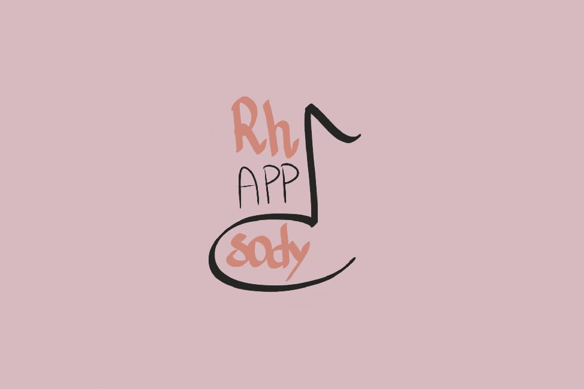
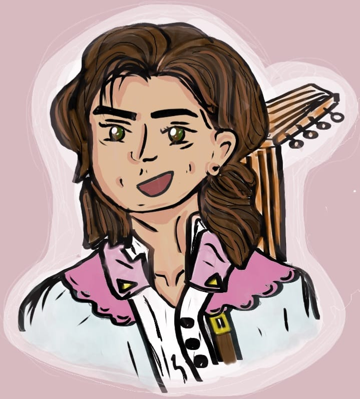

# RhAPPsody

  

---

## 🎵 What is RhAPPsody?

RhAPPsody is an **interactive application** designed for the exam of Digital Heritage and Multimedia at [Alma Mater Studiorum- Digital Humanities and Digital Knowledge Master's degree](https://corsi.unibo.it/2cycle/DigitalHumanitiesKnowledge). 
The app allows visitors to **explore and interact with the musical instruments** in the museum’s collection in a unique and engaging way.  

---

## 🧙‍♂️ Meet Bard, your guide 

  

Bard is the cheerful minstrel and mascot of RhAPPsody, guiding users through the magical world of music.  
With him by your side, dive into melodies, discover stories behind instruments, and play along with digital and real sounds.  

---

## 🎶 Features

- **Instrument interaction:** Play and learn about historical instruments from the museum's collection.  
- **Storytelling:** Discover tales and legends about musical heritage through Bard’s voice.  
- **Multimedia library:** Access sounds, videos, and images related to Bologna’s musical culture.  
- **User-friendly interface:** Designed to be intuitive for visitors of all ages and backgrounds.  

---

## 🏛️ About the Museum

The Music Museum and Music Library of Bologna hosts a rich collection of historical instruments, manuscripts, and documents.  
Learn more here: [Museo internazionale e biblioteca della musica](https://www.museibologna.it/musica/).  
